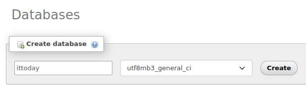

<h1 align="center"></h1>

# Aplikasi Web **"IT TODAY"**

[Sekilas Tentang](#sekilas-tentang) | [Instalasi](#instalasi) | [Konfigurasi](#konfigurasi) | [Otomatisasi](#otomatisasi) | [Cara Pemakaian](#cara-pemakaian) | [Pembahasan](#pembahasan) | [Referensi](#referensi)
:---:|:---:|:---:|:---:|:---:|:---:|:---:

## Sekilas Tentang
**Noted** merupakan aplikasi berbasis website yang bertujuan sebagai pencatatan keuangan dan penyimpan catatan. Aplikasi ini tidak hanya menyediakan fungsi dasar pencatatan transaksi, tetapi juga dilengkapi dengan fitur visualisasi yang memungkinkan pengguna melihat data keuangan mereka dalam bentuk grafik. Dengan Noted, pengguna dapat dengan mudah melacak dan memahami pola pengeluaran dan pemasukan mereka melalui representasi visual yang jelas dan informatif sehingga memudahkan pengguna untuk mengelola keuangan pribadi dengan lebih efisien.

# Instalasi

### Kebutuhan sistem :
- OS: Linux/Windows
- Apache Web server 1.3+.
- PHP 5.2+.
- MySQL 5.0+.

### Proses instalasi :
- Membuat environment baru dengan application server apache versi terbaru dengan **php versi 8.0.29**

  


- Selain application server, digunakan database server berupa database mysql. Dan mengubah domain menjadi [it-today.user.cloudjkt01.com](it-today.user.cloudjkt01.com), setelah menekan tombol `create`, ditunggu beberapa menit agar environment tercipta

  


- Deploy menggunakan git dan memasukkan link repository github beserta token sebagai autentikasi untuk repository privat

  


- Auto-resolve conflicts dimatikan dan tombol `deploy` ditekan

  


- Berikutnya adalah membuat database baru pada `phpmyadmin`

  


- Selanjutnya adalah membuat file `.htaccess` pada `~/webroot/ROOT`

  


- Mengubah `.env` menjadi seperti berikut

  


- Kemudian, kita menjalankan command command berikut
    ```
    cp .env.example .env
    composer install --ignore-platform-reqs
    composer update
    php artisan storage:link
    php artisan key:generate
    php artisan migrate:fresh --seed
    ```


## Konfigurasi (opsional)

Setting server tambahan yang diperlukan untuk meningkatkan fungsi dan kinerja aplikasi, misalnya:
- batas upload file
- batas memori
- dll

Plugin untuk fungsi tambahan
- login dengan Google/Facebook
- editor Markdown
- dll


##  Maintenance (opsional)

Setting tambahan untuk maintenance secara periodik, misalnya:
- buat backup database tiap pekan
- hapus direktori sampah tiap hari
- dll


## Otomatisasi (opsional)

Skrip shell untuk otomatisasi instalasi, konfigurasi, dan maintenance.


## Cara Pemakaian

- Tampilan aplikasi web
- Fungsi-fungsi utama
- Isi dengan data real/dummy (jangan kosongan) dan sertakan beberapa screenshot


## Pembahasan
**IT Today** merupakan aplikasi *Management Information System* (MIS) berbasis website yang digunakan oleh mahasiswa sarjana Departemen Ilmu Komputer IPB dalam mengadakan rangkaian acara IT Today. Website ini digunakan sebagai media informasi mengenai berbagai *event* seperti seminar dan juga informasi kompetisi. Selain itu, IT Today juga digunakan untuk melakukan manajemen pendaftaran peserta kompetisi. Aplikasi ini dibangun dengan menggunakan HTML, CSS, JavaScript, dan bantuan *framework* Bootstrap sebagai pengembangan *front end*. Pengembangan *back end* dikembangkan dengan menggunakan bahasa PHP melalui *framework* Laravel dan Livewire. Database yang digunakan ialah *relational database management system*, dengan menggunakan MySQL. **IT Today** memiliki berbagai kelebihan yang dapat memberikan value yang lebih bagi pengguna, di antaranya adalah 

- Memiliki panel administrasi yang juga terbagi menjadi *role* bagi masing-masing admin, sehingga memudahkan dalam memanajemen *task* yang diperlukan. 
- Memiliki tampilan UI yang sangat menarik dan interaktif, sehingga tidak membuat bosan pengguna.
- Memiliki navigasi yang cukup jelas, sehingga tidak membuat pengguna menjadi kebingungan.
- Dari segi *responsivity*, aplikasi dikembangkan dengan cukup responsif, sehingga tampilannya dapat diakses dengan mudah dan nyaman di berbagai ukuran *device*.
- Berbasis bahasa Inggris dan Indonesia, sehingga memudahkan banyak pengguna.
- Berbagai fitur disediakan dan dengan jelas terbagi oleh masing-masing *role*, sehingga memudahkan penggunaannya dan keamanannya data juga terjaga.
- Memiliki keaamanan yang dikembangkan dengan sangat baik di berbagai fitur dan layanannya.

Di samping itu, **IT Today** memiliki beberapa kekurangan di antaranya ialah

- Tidak dapat mengatur atau melakukan *sorting* terhadap urutan peserta kompetisi pada *dashboard*.
- Konfirmasi status pembayaran yang masih dilakukan secara manual oleh admin.

Jika dibandingkan dengan *Money Management System (MMS)* sejenisnya seperti **Actual**, **Noted** memiliki keunggulan dan kekurangan. Berikut adalah perbandingan antara kedua MMS tersebut:

1. Fitur yang disediakan oleh **Compfest** jauh lebih banyak dibandingkan pada **IT Today**.
2. **Compfest** memiliki *light mode* dan *night mode*, sehingga pengguna dapat menyesuaikan preferensinya.

## Referensi

Cantumkan tiap sumber informasi yang anda pakai.
